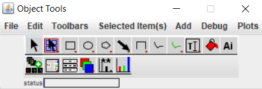
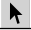
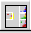
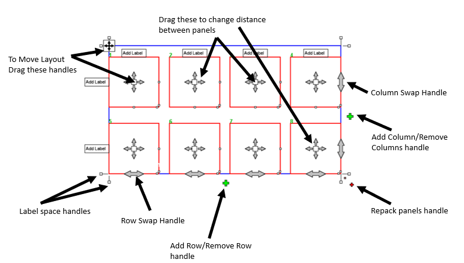
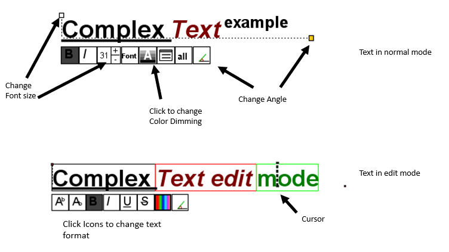

# QuickFigures User Guide  
By Gregory Mazo  
Publications involving fluorescent microscopy generally contain many panels with split channels, merged images, scale bars and label text. Similar layouts of panels are used when displaying photographs, electron micrographs and other forms of images. Assembling and editing these figures with even spacing, consistent font, text position, accurate scale bars and other features can be tedious and time consuming. In order to save time and streamline the process I have created a toolset and ImageJ Plugin called QuickFigures. This user guide covers the key features. Please reach out to me if you have any questions or recommendations.  

## Section 1: Install 
### Install instructions
### Fiji Install: 

#### Step 1: update Fiji (if not already up to date)
-	Go the Help menu and select **'Update'**
-	Apply changes to make sure your Fiji is up to date
-	Restart Fiji

#### Step 2: Install QuickFigures
-	Go the 'Help->Update' menu item again
-	After a moment, Fiji will tell you that you are up to date
-	In the next dialog window click **Manage Update Sites**
-	QuickFigures will appear in the update site list
-	Check QuickFigures 
-	Close that window.
-	Click Apply changes to download QuickFigures
-	Restart Fiji
-  A QuickFigures Menu will be present on the menu bar 
-  Go to the QuickFigures menu and select 'Show Main Toolbar'. 
-  Open an image and get to work!

### Ordinary ImageJ Install. 
Although installing on a Fiji distribution is the easiest way to install QuickFigures with all the features (including Export), users can also install QuickFigures on a standard ImageJ distribution.  
#### Step 1: Install an up to date version of ImageJ. 
You can either download a fresh copy of ImageJ (recommended especially if you have an old install) or go to Help menu and choose 'Update ImageJ'

#### Step 2: Download QuickFigures
https://github.com/grishkam/QuickFigures/raw/master/QuickFigures_.jar  
copy the file into the plugins folder of ImageJ

#### Step 3: Download optional dependencies for extra features
If you are using ordinary ImageJ1 and not FIJI, additional files must be downloaded to use some features of QuickFigures.
-	If you will be opening microscopy file formats, download **loci_tools.jar** file and copy it into the plugins folder
https://downloads.openmicroscopy.org/bio-formats/4.4.12/
-	After installation of loci tools, one should be able to import microscopy files into ImageJ using Bio-formats (File->Import->Bio-Formats). One should set the Bio-Formats import Options to import the files as a 'Hyperstack' (in the stack viewing section), the import Color Mode should be set to 'Composite' preferably with the 'Autoscale' Checkbox set. All other part of the Bio-Formats import options can be left unchecked. Once those options are set, one should try a windowless Bio-formats import (also in the import menu).
-	If you intend to export as SVG, PDF, or EPS you will need to download apache batik
https://xmlgraphics.apache.org/batik/download.html
As of this moment, Batik 1.13 or higher is required. Unzip the downloaded file and place that folder into the plugins folder of ImageJ
-	If you intend to export as PowerPoint or use the plot package for QuickFigures you will need Apache POI.
https://poi.apache.org/download.html
As of this moment, QuickFigures works with the Apache POI (4.1.2). Those who downloaded QuickFigures before the update can download/use POI 3.12. 
Copy the Apache POI folder into the plugins folder of ImageJ. Any .jar files that are in subfolders of the poi folder may need to be moved into the main POI folder
-	Certain features of the Plot Package within QuickFigures also require Apache Commons-Math3 package. Math3 should be included in downloads of apache poi. If it is absent, 
https://commons.apache.org/proper/commons-math/
-	Go to the QuickFigures menu and select 'Show Main Toolbar'. 

## Section 2: Getting Started 
### Creating Figures from images
1.	QuickFigures' toolbars and windows have their own menu bars (not the same as the ImageJ Menu bar). If using a MacOS, the menu bar will appear at the top of the screen after you select one of the toolbars.
2.	You can create a new Figure using the options in the New menu (File->New) to creates figures Each of these options will create a new worksheet. The types of options are summarized below.
    -	**Empty Worksheet** creates a worksheet without objects. Figures can be added to any worksheet by drag and drop of image files. Dragging an image file onto an existing figure, adds another image to the figure. 
    -	**Figure With Split Channels** always creates a figure with split channels in a new worksheet. If a multichannel image is open in ImageJ, that image will be used to create a figure, otherwise the user will be asked to choose a file. 
    -	**Figure With Merge Panels Only** always creates a figure with all channels merged in a new worksheet. If an image is open in ImageJ, that image will be used to create a figure, otherwise the user will be asked to choose a file.
Note: For each of these options. The new figures created will be based on the default template. Read sections on [figure format and templates](#Figure-Format-Submenu). A use can customize the default template based on their own needs.
3.	Alternatively, a user can click the **Quick Figure** button on the toolbar which works like the options in the **New** menu.
4.	You can export anything you create into other file formats using the Export menu (File->Export). Some export menu items will only appear if the required packages are installed. 

### The Basics of Using QuickFigures

- The **Object Tools** toolbar is the main toolbar for QuickFigures. It contains all the critical tools for selecting and drawing objects. Like the ImageJ toolbar, double clicking on a tool icon displays an options dialog relevant to that tool. Similarly to the ImageJ toolbar, control clicking/right clicking on many of the tool icons allows the user to access additional tools. The most important tool families are summarized below.  

    - The **Object Selector Tool** is used to click on, select and move objects within the figures. Clicking on any object selects it and deselects all others. A user can select multiple objects by holding shift while clicking on one object after another. If a user starts a mouse drag in a location without an object and drags over an area, all objects in the area will be selected after the mouse is released. When an object is selected, its handles will appear. A user can edit an object simply by dragging the handles. A user can right click on an object or handle to display a popup menu specific to the clicked object. If the user double clicks on an object or a handle, a dialog window with options specific to that object or handle may appear. If the user double clicks a [text item](#Text), that item switches to **text edit mode** in which a user can edit its text via the keyboard. Clicking on another item, switches off text edit mode. For most objects, a set of icons composing a 'mini toolbar' will also appear below the clicked item. By clicking the icons in the mini toolbars one can perform nearly every type of edit. Most edits done with the mini toolbars apply to all selected objects. Users will rarely switch away from this tool.
  
 
    - The **Layout Selector Tool** is a version of the object selector that selects only [layouts](#Layouts) (even if a layout is behind another object). Although layouts may be selected using the **Object Selector Tool**, users may find the **Layout Selector Tool** more convenient if a lot of objects are in front of the layout. 
 
     
    - The shape tools can be used to draw a variety of [shapes](#Shapes). A user can switch back to the **Object Selector Tool** by pressing the spacebar or enter. Right clicking on the tool icons shows the variety of alternate shapes. One may draw rectangles, circles, arrows, polygons, lines, curves, stars, gears, triangles, blobs, and other shapes.
  
       
    - **Add Text Tool** is used to draw a fragment of [text](#Text). A user can right click on this tool for access to specialized versions of it. The tool may also be used to edit text.
  
     
    - **The Quick Figure Tool** creates a new figure from a multidimensional image. If an image is open in ImageJ, that image will be used to create a figure, otherwise the user will be asked to choose a file. New figures may either be split channel or contain only the merged image depending on what the user has set as the default template.
   
     
    - **The Inset Tool** creates a set of small panels that show a subsection of the parent image. To use this tool, a figure must already be created. The user can draw a region of interest on one of the image panels in an existing figure. This tool then creates a series of smaller "daughter" panels beside the parent panel. Users can later resize or rotate those regions of interest to change what is displayed in the daughter panels. By double clicking on the inset tool, users can access a dialog that may be used to change how the tool creates daughter panels (altering preferred location, scale factor or number of panels). The regions of interest are editable objects that can be altered just like any [shape](#Shapes). Right clicking on the [regions of interest](#Insets)) brings up a popup menu with options related to the daughter panels.  
    
      
     
    - **The Channel Tools**. These tools have been made partly obsolete by alternative functions. Channel Swap and Color Swap tools are rarely needed and may or may not be included in later versions of QuickFigures. Under very specific circumstances in which some source images are saved with different/inconsistent channel order this channel swap tool may be used to switch the channel order of the source images.

## Section 3: Editing Figures and Channels

### **Popup Menus** 
Popup menus appear when a user right clicks on image panels, insets, layouts, or figures. The submenus contain options for many types of edits. The most important submenus and menu items are described below.

#### **Channels** Submenu
The **Channels** submenus contain options related to the channels within figure. It will appear inside of the popup menu for [image panels](#Image Panels) and other objects. Depending on the object clicked and the context, slightly different versions of the channels submenu will appear. The channels menus contain the following items

  -	**Display Range**, **Window/Level**, or **Min/Max**. These options open display range adjuster similar to the display range adjuster found in ImageJ and other Software. Adjustments done with this adjuster affect both split channel panels and merge panels. [see Display range dialog for details](#Display-Range-Dialog)
  -	**Change color modes** menu item switches channel panels between 'colorized' and 'greyscale' displays. Panels with more than one channel will always be displayed in a colorized form regardless of this option.
  -	**Channel Use Options**. Displays the **Channel Use** dialog ([See section on Channel Use Dialog](#Channel-Use-Dialog)). This dialog allows the user to select which channels are used in the merge panel, change color modes and also merge an itional channels into the channel panels. 
  - **Recolor channels** submenu. This allows the user to change the color of channels from one pseudo-color to another. Colors for channel panels, merged panels and [channel labels](#Channel-Label-Text) will all change in response to this item. For user's familiar with ImageJ, this menu item changes the lookup table.
  -	**Recolor Channels Automatically**. Changes the color of every channel based on the channel names. Images imported from certain microscopy formats (.czi, .zvi) will have channel names that reflect the dye names (eGFP, Cy5, mCherry) while others will have channel names that reflect colors. This automatic recoloring can also be performed in other contexts.
  - 'Match' menu items. Each figure may contain several images. The options can be used to make sure that variables such as channel display ranges, channel colors and channel order are consistent between images. If only one source image is part of the figure, this menu item will not appear.

#### Figure Submenu
The **Figure** submenu appears in the popup menus for layouts and image panels if those objects are part of a figure. It will appear inside of the popup menu for [image panels](#Image Panels) and [layouts](#Layouts).
 -	**Add Image** submenu allows a user to add a new multidimensional image to the clicked figure. Although users can add source images by dragging/dropping files onto the figure, this option provides an alternative. The scale, the number of channel panels created, and other properties from the existing source image are used for the new one. 
 -	Items in the **Add Labels** submenu create an entire set of labels for the rows, columns or panels of the figure.
 -	The **Recreate All Panels** menu item displays the recreate panels dialog. [See sections on recreate panels dialog for details.](#Recreate-All-Panels-Dialog)
 -	The **Images** submenu of the Figure Menu contains several menu items that affect how the source images are used to create the image panels. Each of these items go back to the source images (the 'original datasource') to repeat certain processing steps and update the image panels.
     -   **Re-crop** option displays crop dialog windows for the user to change the region of interest and the rotation angle for each of the source images. After the user has changed the size of the first images' selected region, the size chosen becomes the starting size for each subsequent dialog. That allows the user to apply a consistently sized crop area to every image. For users familiar with ImageJ this process is equivalent to opening all the original image files, redrawing the crop areas precisely, using the **Crop** and **Rotate** commands in ImageJ and replacing each image panel in a figure with the newly cropped/rotated version. This single option replaces that entire process (along with the scale step). While a cropped version is displayed by the image panels, the original image is keptby QuickFigures.
    -   **Re-Set Scale** option. This changes the scale factor applied to each image and updates the image panels. For users familiar with ImageJ, this process is equivalent to opening all the original image files, using the **'Scale...'** command in ImageJ repeatedly and replacing every image panel in a figure with the new scaled version. This single option replaces that entire process (along with the rotate and crop steps). While a scaled version of the image will be displayed in the panels, the original image is always kept by QuickFigures. If one re-sets the scale again, it will create a new scaled version from the original. The scaled version will have some loss of image quality compared to the original.  
    -   **Re-Set pixel density**. Functions similarly to the Re-Set scale command. Except this option does not alter the apparent size of the image panels. Instead, the user is prompted to choose a final pixel density (200 pixels per inch for example). Both the scale factor and the panel size are changed such that the final pixel density of each image panel becomes the desired amount. Since journals normally require a certain pixel density (either for the overall figure or for image panels) a user should not choose a pixel density much lower or much higher than their requirements. QuickFigures uses the same inch definition as Adobe Illustrator (72 points). Users of Inkscale may be confused to find that the inches and font size displayed in Inkscape differs from QuickFigures and Adobe Illustrator.
    - **Scale Object** and **Re-set scale**. This option scales everything in the figure (labels, layouts, shapes) not just the scale factor for the image panels. Otherwise it is similar to the **Re-Set** scale menu option. 
    - **Resize panels without scale reset**. This option only changes the panel size without changing the scale factor. This is equavalent to dragging the handles to scale image panels in PowerPoint or Illustrator. This will change the pixel density but not result in any changes to the pixels. 
 -	**All Channels**. A channels menu. The content of this channels submenu does not depend on which channels are present in the clicked panel. Otherwise it is similar to the other channels menu. [see the section on the channels menu for details](#Channels-Submenu) 
 - **Exclude channel**. Items within this menu can be used to add or remove channel panels from the figure. The same channels will also be removed from the merge image panels. Unlike the 'Recreate Panels' dialog, this menu only affects items with the targeted channel.
 - **Format Figure** submenu. See section on [figure format](#Figure-Format-Dialog) submenus and templates. The submenu that appears in the popup will target only the clicked figure. 
 - **Scale Figure**. Scales all object within the figure. 

#### This Image Submenu
**This Image** submenu contains options that apply to the source image for the clicked panel. The menu options are similar to the submenus within Figure Menu and the channels menu except for their scope. The most important options that are within this menu and within its' submenus are summarized here. 
 -	**Create Second View**. Adds another image and another set of panels to the figure using the same data source but with a different crop area
 -	**Remove From figure**. Removes the image from the figure. This will remove all image panels and channel labels (if the channel label are with those image panels).
 -	**Set Pixel Size**. Equivalent the **Set scale...** menu item within ImageJ. Allows the user to change the physical distance measurements for the size of a pixel. For example, a user can input that 100 pixels of the original source image correspond to 60 micrometers in physical distance. Afterwards, scale bars for each image panel are changed to reflect the new values. 
 -	**Advanced Channel and Frame Use** changes the image to advanced channel use mode and displays the [Advanced Channel Use](#Advanced-Channel-And-Frame-Use-Dialog) dialog. Although the options in the normal **Channel Use** dialog will be sufficient for most purposes, advanced channel use allows for more customization of panels.
 -	**Re-Crop** crops only the selected image. Although this changes the crop area, an uncropped version of the full size image is still stored.
 -	**Re-Set Pixel Density**, See re-set pixel density from the [figure menu](#Figure-Submenu) section. This menu item only targets the clicked image.

#### Channel Label Submenu
**Channel Label** submenu contains options related to the [channel labels](#Channel-Label-Text). Will only affect the channel labels for the clicked image and not other images in the figure. 
 
#### Other submenus
**Expert Options**. Options that are expected to interest relatively few users are placed in these submenus. To avoid confusing new users, this user manual does not contain details of those tools. See [supplemental user guide](SupplementalUserGuide.md) for details of these options (not yet written).

#### Image Panel Popup Menu
The popup menu contains options related to the clicked [image panel](#Image-Panels) or the figure containing that panel. When an image panel is part of a figure, Image Panel popup menus can contain options related to the [channels](#Channels-Submenu), [This Image](#This-Image-Submenu) and the [figure](#Figure-Submenu).
The **Add Shape** submenu along with the **Add Scale Bar**, **Add Text** options are part of this popup menu for every image panel. Added object are placed in the same layer as the figure and subject to the same layout. The added scale bar and added text will be [attached](#Attached-Items) to the [image panel](#Image-Panels).

#### Scale Bar Popup Menu
The popup menu contains options related to the clicked [Scale Bar](#Scale-bars). The **Bar Text** submenu contains options related to the label which indicates a scale bar's length including an option to show or hide the [text](#Text). The **Adjust Position** menu option will display a [Attachment Position Dialog](#Attached-Items) that the user may use to input specific numeric values for the position of the scale bar. Although the scale bars can be moved between panels by drag and drop, the **Switch Panels** submenu provides an additional means of transplanting a scale bar.

#### Layout Popup Menu
The popup menu contains options related to the clicked [layouts](#Layouts). The **Edit Layout** Submenu is detailed in the section on [editing layouts](#Editing-Figure-Layouts) for details. If the layout is part of a figure, it may also contain a [Figure submenu](#Figure-Submenu). If objects are either attached or available for attachment to the layout, the menu will contain [submenus](#Attachment-Submenus) related to those items.

### Attached Items
Certain items like [labels](#Text) and [scale bars](#Scale-Bars) are 'attached' to [image panels](#Image-Panels) (or attached to [layouts](#Layouts)). When a user moves the parent panel, the attached items will move accordingly. When a user attempts to drag an attached item, it will respond differently than a free object. Locations of attached items are determined by their attachment position and the location of their parent panel. Attached item positions can be edited in a few ways.
  1.	Dragging the attached item directly. Normal mouse drags will alter the type of attachment location. For example, an item that is anchored at the lower right of a parent panel can be moved to the equivalent location in the upper right by a simple mouse drag. A user can also move an item from one parent panel to another or detach the item from its parent by dragging and dropping.
  2.	Using the attached item handle. Attached scale bars and text items will have an additional handle that allows the user to alter their attachment position (this appears as a red dot). By clicking and dragging within the red dot, a user can make small adjustments to the attachment position. A user can also click just outside of the red dot to change the type of location.
  3.	Using the attachment **Position** dialog. A menu item to display this dialog will be present in the popup menu for the attached item (as well as other menus and mini toolbars). A simpler version of this dialog will also appear in the position tab of other dialogs. A user can click and drag the blue square within the dialog to change the base location (from the Upper Left to Top for example). Finer adjustment to the location can be done with the sliders and numeric fields in this dialog.  
Users can also click the  icon seen below a selected item to show a position dialog that applies to all the selected items. This attachment position dialog can also be used to assign the same attachment position to many labels ensuring consistent spacing of labels (using the **Keep Relative Positions Same** checkbox that is present in the complete dialog).  Labels can also be attached to a row, column, or panel of a layout. The dialog also contains an option for switching the attachment position between row, column and panel modes (rarely used).  
  
  
### Attachment Submenus
**Attach Item** and **Release Item** submenus appear in the popup menus for [layouts](#Layouts) or [image panels](#Image-Panels) if there is an object in position for attachment (or already attached). See section on [attached items](#Attached-Items). Since labels and scale bars are automatically attached to panels and can be moved by drag/drop, users should rarely have any need to attach/detach objects manually. If no relevant object is available, these submenus will not appear. In order to move an object into position for attachment, drag the item above the parent that you want to attach it to.

### Editing Figure Layouts
Figure layouts can be edited in three ways 1) by clicking the layout and dragging the handles or 2) by using the tools in the 'layout tools' toolbar or 3) by right clicking on the layout and using the options in popup menu. Since all three of these methods allow the same types of edits, one does not need to learn every single method.
#### 1) Editing using handles.
A user can click on a figure layout just like any other object. Several kinds of handles allow the user to edit the figure layout simply by clicking and dragging. A user may also double click on layout handle to display a dialog where specific measurements can be entered.  The handles available for a standard figure layout area are detailed below

-	Panel Handles. Alter the distance between panels. The first panel handle can be used to move the entire figure.
-	Layout location handle. This handle (near the upper left of the layout) can also be used to move the entire figure
-	↕↔. Row Swap Handles, Column Swap Handles, and Panel Swap handles. allow the user to swap the contents of two rows, columns or panels within the layout.
-	Add label handles. Clicking on each of these handles adds at their respective location. That may be either a row or a column label.
-	Add (or Subtract) Row (or Column) handles. Allow the user to increase or decrease of number of rows or columns manually by dragging each handle. Objects within the layout are not moved by these handles.
-	Repack panels handle. This handle also adds or subtracts the number of rows and columns. However, this handle also redistributes the objects within the layout.
-	Label Space handles. The spaces above, to the left, below, and to the right of the panels are meant for labels. Although these spaces are adjusted automatically, the user is also allowed to make manual changes using these handles.
-	Panel Size handles are on the bottom or right edges of panels. Although panel sizes are adjusted automatically, in the user may also perform manual edits using these handles.
-	Layout scale handle. Scales the layout and all objects within it. This handle is more convenient than selecting all the objects and then scaling them.  

  
 
  

#### 2) Editing layouts using the layout tools.
An addition toolbar for layout tools is available. The user can go to Toolbars->Show Layout Tools to display this toolbar. These tools accomplish the same specific tasks as the layout handles. Although the layout handles are more convenient, the layout tools are somewhat easier to learn (since each tool icon demonstrates the function of the tool and each tool performs exactly one function). None of the layout tools are essential.

  
-	**Select layout** tool. This tool will only select layouts and ignore anything else. Although a user can always click on and select a layout, this tool becomes convenient if most of a layout is behind other objects (such as panels). After clicking on a layout with this tool, a user can edit the layout by clicking, dragging the handles, right clicking, double clicking and so on. The other layout tools cannot be used in this way.
-	**Adjust border** tool. This tool alters the distance between rows/columns of the clicked layout.  
-	**Swap Row Tool**, **Swap Column Tool** and **Swap Panel Tool**. These tools swap the contents of two rows, two columns or two panels.
-	**Move layout** tool. Moves the figure and all of its contents.
-	**Adjust label space** tool. Used to manually change the label spaces. 
-	**Panel number change** tool. Changes the number of rows and columns.
-	**Label Text Tools**. Allow the user to add row, column or panel labels.
-	**Scale layout** tool. Scales the figure.
-	**Expert tools** These will appear in the popup menu for the panel number change tool. Since these tools will be of interest to only a few users, details of their function are not included in this user guide. See [supplemental user guide](SupplementalUserGuide.md) (not yet created). 

#### 3) **Editing the layout using popup menus and dialogs**
A popup menu will appear if the user right clicks on a layout (using the object selector tool). The **Edit Layout** submenu allows the user to perform the same tasks as the layout handles and layout tools. Different dialog windows will appear for each menu item. Within the dialog windows, users may input specific numbers for the measurements of their layouts. If a user double clicks on a layout, (or a layout handle) similar dialog windows will appear. Depending on the location being clicked, a different dialog will be shown. 
  

#### 4) **Layout content** 
Layout handles, layout tools and menus only affect objects that are within the layout. Objects that are both within the same parent layer as a layout and within the bounds of the layout are treated as within the layout. Although the layer structure is organized automatically, a user can also manually move objects between layers using the [layers window](#Layers-Window). 

### Specialized Dialog windows

#### Recreate All Panels Dialog
The **Recreate All Panels** dialog allows the user to change the options for generated image panels, and create new image panels according to the new options. Panels are recreated from the original source images when the user changes an option within this window. The window is divided into a **Channels and Panels** tab and a **Frames and Slices** tab
**Channels and Panels** tab: contains options related to channels and panels.
-	**Created Panels** option allows the user to select which panels to create for the channels. A user can choose to include a Merge Panel, Split channel panels, or Both. A user can choose to place the merged panel, after the channel panels or before. 
-	**Exclude These Channels Panel(s)** If channel panels are being made, a user can choose not to omit one or more of them. This excludes that panel for that channel but does not affect the merged image. 
-	**Don't Merge These Channel(s)**  If a merge panel is being made, a user can choose not to include every channel in the merged image. A user can select one or more channels using this option.
-	**Channel Color Mode** options changes the color mode for the channel panels between colorized and greyscale.
-	The **Merge Each Channel With** option. Split channel figures sometimes contain two channels per panel. A user can select one channel to merge into every channel panel. A separate channel panel for the channel chosen will not be created.
-	**Scale Factor** field. The user can choose to apply a scale factor to every image. This scaling process is equivalent to using the 'Scale...' command in ImageJ. Although the 'Scale…' command in ImageJ has a few options for interpolation method, QuickFigures simply uses the default (Bilinear interpolation). 
-	The **Panel Pixel Density** field determines the final pixel density of the newly created panels. This is equivalent to resizing image panel objects in Adobe Illustrator until the panels reach a certain pixel density (by dragging the corners). Changing this field will also resize the panels. This is not to be confused with the Re-Set Pixel density menu item.
-	**Ideal number of columns** field. A user sets a limit on the number of columns created. The newly created panels are not to occupy more than the number of columns set here.
-	**Frames and Slices tab** If any of the multidimensional images used for the figure contain more than a single time frame or more than a single optical section, this tab will appear. Otherwise this tab will not appear. A user can change what frames or slices are used by typing into the field. One can type the numbers as a list, write in a range or a formula (examples are shown in the dialog). A separate subtab for each source image will appear. If the source image(s) contain one channel and many frames or slices, the dialog will open with this tab in focus.  

#### Channel Use Dialog 
The **Channel Use** Dialog allows the user to change how the channels are merged to create the image panels. Although it contains similar options to the Re-create panels dialog, the channel use dialog only changes how existing panels appear and does not create new panels nor delete old ones. Options in this dialog include **Channel Color Mode**, **Don't Merge These Channel(s)** and a **Merge Each Channel With**. Each work as described above for the [re-create panels dialog](#Recreate-All-Panels-Dialog).  

#### Display Range Dialog
Display range dialog windows are used to change the display range for one or more channels. A user can open them using popup menus that appear when one right clicks on an image. These menu items are equivalent to the **Min/Max** and **Window/Level** commands in ImageJ. The window functions similarly to the ImageJ versions except that both merged images and split channel panels are adjusted in the same way. Depending on which channels are present in the image panel that was clicked on, these dialogs may have multiple tabs for different channels. Depending on which popup menu was used to open these windows, the adjustments may apply to either one source image or multiple source images. By setting the same consistent display range for multiple source images, this dialog ensures that any visual comparison of intensity is valid.  
A user can select multiple images and click the  that appears below one to display a dialog that applies its affects to the selected images.  
The target images for a display range dialog do not change while the dialog is open (unlike the ImageJ equivalent).  
  
#### Crop Dialog
The Crop dialog window provides a way to change the crop area and rotation angle used for a source image. A user can either input numbers in the fields to the right of the window or drag the handles of rectangle. Depending on the image, the dialog may also contain an option to change which channel, frame and slice is being shown while one edits the crop area. At the bottom of the window, there is an **Eliminate Cropping Rectangle** button which offers the options not to crop (nor rotate). A few different popup menu options can open a crop dialog.  
A user can select multiple images and click the  icon to display a series of crop dialogs for those images only.

#### Select Example Dialog
This dialog is shown when the user chooses the **select example** menu option in the Figure Format menu. A user can browse through a list of figures, each of which is visible in the popup menu. After selecting a figure, a user may choose it to be the default template by clicking the button on the bottom of the dialog. Although this contains fewer options than the Figure Format Dialog, a user can use this dialog even if no figure is open. 

#### Figure Format Dialog
The dialog will be shown when the user chooses to create a custom template using Figure Format menu. This dialog allows the user to choose example objects for their custom template. One object of each category will be automatically chosen. The example objects in the current figure will be available as options. A user may select an example scale bar, an example channel label, an example image, an example layout and so on. Template with example objects will be saved after user presses OK. Later, when the user goes back to the Figure Format menu to apply a template to another figure, the saved objects will be used as models and the appearance of targeted figure will be altered to match the style of the example objects. Since saved objects.   

#### Layers Window
The layers window contains a tree with objects and layers displayed with their names and icons. All objects in QuickFigures are organized into layers. Using the layers window (access via Show Layers menu option is in the Edit menu), a user can change the order of objects within a layer by clicking and dragging. Users can also add new objects/layers using a menu bar that is specific to the layers window. The layers window is most useful when creating illustrations or drawings. A user can manually create a layer using the menu bar, select that layer and then use the toolbar to draw objects within that layer.
For automatically created figures, the layer structure is organized automatically and is critical for QuickFigures to work properly. Certain specialized layers perform other functions besides simply acting as passive containers. Removal of an automatically generated object (such as an image panel that is part of a split channel figure) from its specialized layer is not recommended as it can alter or turn off some of the specialized functions. For reference, ordinary layers use a blue folder icon while specialized layers are colored differently.  
Objets can be hidden and un-hidden using the layers window (just click the icon next to the object name. layers cannot be hidden in this way).  

#### Advanced Channel And Frame Use Dialog
Using the buttons in the 'Advanced' channel use dialog, a user can assign a completely arbitrary combination of channels to image panels, add panels, or set an arbitrary stack slice to a panel. A user can also re-order panels or channels via drag/drop (using either the panel list on the left or the channel list on the right). However, if the user later selects the normal channel use options (or related menu options), the image will return to normal channel use mode and actions done in advanced channel use mode will not be preserved. Multichannel images are either in advanced channel use mode or in normal channel use mode. Users will rarely need this dialog.

#### Page Size Dialog
Dialog shown when a user selects the "Resize Canvas" menu option in the Canvas submenu (Edit->Canvas->Resize Canvas). This dialog works similarly to the page size or canvas size options in other applications. Users who do not want the automatic increases to page size (those occur when a user edits a layout beyond the edge of the canvas) may click the checkbox to block them. Also, if a user changes the units to cm, the rulers for figues will also change to centimeter and will stay metric (even after ImageJ is closed and restarted). 

## The Menus and Menu Bar
The **Menu Bar** contains only a few major menus. File, Edit, Selected Item(s) and Add.
### File Menu
- The **File** menu is designed similarly to the file menu in any software. The **Export** submenu contains menu items to export into one of several possible file formats (PPT, SVG, PDF, TIF, PNG or EPS ). The export submenu also contains an option to generate the figure in Adobe Illustrator. Users can open exported files to finish editing in their preferred software. The **New**, **Save**, and **Open**, submenus contain menu items that create, store and retrieve QuickFigures worksheets and all of the figures/objects within them. Although both the save and the open menu items are fully functional, the form that the saved files take will change in future updates to QuickFigures. Although the saved files may be used for short term storage, users should export the files into a format such as SVG, PDF or PowerPoint.

### Edit Menu
The **Edit** menu contains a variety of options that do not depend on which objects have been selected.
-	**Undo** and **Redo** menu items work similarly to any software. A user will not always be allowed to redo all actions. 
-	**Show Timeline** displays a timeline GUI for creating simple animations. 
-	**Show Layers** displays the layers window for the current worksheet
-	The **Canvas** submenu contains options for changing the current worksheet. The equivalent concept is called canvas size in many applications. The **Resize Canvas** menu item displays a dialog where the user may input a specific size. QuickFigures may also attempt to automatically resize the worksheet to fit increases in figure size. An option to **Block Auto Resize** is available in the Resize Canvas dialog.
-	The **Zoom** submenu provides options for zooming in, zooming out, and setting a specific zoom level. The **Set Zoom Level** dialog has an option for the current zoom level. A window may be resized after a zoom level change. If the user wants the window size to stay constant after every zoom, there is an option for that in the **Set Zoom level** dialog. Users may also zoom in ans out by either pressing +/- keys or holding control down while using the mouse wheel.
-	The **Copy to System Clipboard** works as its name suggests. It creates an image of the current worksheet and copies it the clipboard. The copied image can then be pasted into any application (Word, PowerPoint, Paint). Since the copied image includes transparent pixels, the **System Clipboard** command in ImageJ will not create a proper version.
-	The **Combine Open Worksheets** menu item displays a dialog in which the user chooses 2 or more worksheets. It then creates a single worksheet with all figures, objects and layers from the selected worksheets. 

#### Figure Format Submenu
-	The **Figure Format** Submenu contains options to create and use 'templates'. When a user chooses a menu item that creates a template, a dialog window will appear. Within this [dialog](#Figure-Format-Dialog), a user may select objects from the current worksheet to use as examples of a desired format (layouts, images, scale bars and labels). For convenience, several objects will be selected automatically and a user may click ok without changing which objects are selected. That template is then saved into the documents folder (in a 'Quick Figures' subfolder). When a user chooses a menu option to apply a template, the objects in the current worksheet are altered to match the format of a saved template. For example, label fonts are changed to match the equivalent labels in the saved template, spacing between layout panels is changed to match the layout within the template and the style of scale bars is also altered to match the style of saved template's scale bar. 
Changes to the default template are particularly important. The default template is applied to automatically generated figures. Using the **Create Default Template** menu item, a user can change the default template according to their own style. Afterwards, whenever the user creates a figure (whether done with the menu items, the QuickFigure Button or drag/drop) the figure will automatically be made in their style. A user can also delete the default template at any time.

### Add Menu
The **Add** menu contains a variety of menu items that add something to the current worksheet. The contents of this menu will be slightly different for the [Layers Window](#Layers-Window) than for the menu bars of the other windows. For example, the **Add Layer** menu item and several other options will only be present for the [Layers Window](#Layers-Window). After a user creates a layer manually and selects it, newly added items are added to the currently selected layer. See section on layers window for details.  
The add menu has a few submenus
 - **Shapes** submenu contains options to add or group shapes.
 - **to selected panels** submenu contains options to add text or scale bars to image panels. Those items will be attached to the selected panels. Text items added with the same action will be maintain the same position relative to their parent panels.
 - **Raw Image Panel** will add a lone image that is not organized as part of a figure. This option allows users to insert anything into the figure. 
 - **Figure** submenu adds a figure to the worksheet. Functions like the QuickFigure tool. Users can also drag and drop image files onto the worksheet to add them.
 - **Cell Cartoons** submenu contains options to add a family of shapes that have a different style than the ones in the shapes menu.

### Selected Item(s) Menu
The **Selected Item(s)** menu performs specific operations that apply to the objects that the user currently has selected. A user can select an object by clicking on it within the worksheet or clicking within the layers window. Exactly which objects are treated as selected will differ if the menu bar for the layers window is used rather than the bar for the worksheet. 
Within the **Selected Item(s)**  menu there are several submenus. 
-	**Align** submenu contains options to align the currently selected items. Since items in automatically generated figures are automatically aligned to the layout, users will rarely need to user this menu.
-	**Arrange** submenu contains options to move and item forward or backwards within a layer. Since items in automatically generated figures are automatically arranged, users will rarely need to user this menu.
-	**Options Dialogs** submenu provides a way of opening dialogs for editing of objects. If multiple objects of the same type are selected, the dialogs will affect all items that were selected when the dialog was opened. Similar dialogs can be accessed via popup menus, double clicking objects, and clicking certain items in the mini toolbar. Some journals demand a specific font, minimum font size and minimum line width. The **Impose Journal Limits** menu option provides the user an easy was to change those properties via dialog.  Other options are specific to each category of object (text, image panel, scale bar, shape).
-	**Applications Scripts** is a specific submenu for generating scripts to create the objects in adobe illustrator. The script feature was developed using Adobe Creative Suite 5 on MacOS but later updated and retested with illustrator 25.2.1 on windows 10. This option is optimal for users who want to continue their work in Adobe Illustrator. Adobe Illustrator must be set as the default software for opening .jsx files for these features to work. Identical options are present in the export menu (will be exclusively in the export menu in later versions of QuickFigures). Users must have Abobe Illustrator installed for this option to work.
-	**Figure Format** The version of the figure format submenu in the selected items menu will act on the currently selected items only. See section on figure format. 
- The **Toolbars** menu allows the user to open specific toolbars. Users may close toolbars that they do not need and open them again using this menu. Only the main toolbar is critical for use of QuickFigures, the others are optional.
     - **Smart Toolbar and mini toolbars**. When a user selects an item, a set of icons will appear below the selected item. These function as a mini toolbar providing quick access to options specific to the selected item. If a user selects multiple items, the mini toolbar will only appear under one item but will (in most cases) affect every selected item. Furthermore, the user may find it more convenient to use the Smart toolbar (Toolbar) which will show the same icons in a separate window. Whenever a user selects a new item, the icons in the smart toolbar will change to reflect what options are available for that object type.  
	  

     - The align and arrange toolbar functions the same way as the align menu items and the arrange menu items. The toolbar provides somewhat faster access to these options (some users may prefer this).  
	    

     - The main toolbar includes the most critical tools. Object tools is an alternate name for the main toolbar.  
       
     - The **shape and text edit action tools** provide a quick way of making specific types of changes to selected object. The functions overlap with the smart toolbar. This toolbar will be absent in later releases of QuickFigures. 

## Object types 
### Scale bars 
Scale Bars can be attached to an image panel. User can change the length, thickness or appearance of a scale bar by dragging the handles (see diagram below). Each scale bar has a special text object that displays the length of the scale bar. As with other items, a scale bar specific [popup menu](#Scale-Bar-Popup-Menu) will appear when one right clicks while a scale bar specific dialog will appear if one double clicks. The icons below a selected scale bar serve as a 'mini' toolbar whose options will affect every selected scale bar.  
  

### Image Panels
Image Panels display images. Image Panels may either be part of a figure or stand-alone objects. Those that are part of a figure may change appearance when the user changes channel colors or alters the display range for a channel. Panels that are part of a figure will also contain additional handles (see diagram below) and a more complex [popup menu](#Image-Panel-Popup-Menu). For precise alignment of image panels to layouts, a user can drag the center handle of the image panel and drop near the desired panel. While the user drags the center handle, a rectangle will appear in the destination location. If another image panel occupies the destination location, the locations of the two image panels will be swapped. Image Panels may have a colored 'frame' drawn around them (see below). A user can change the width of the frame by dragging the magenta handle. Users will rarely or never need to move image panels directly. If a user wants to avoid accidental edits, that user may select the **Protect from mouse drags** checkbox in the options dialog for image panels.
  

### Layouts
Layouts are also a type of object. See section on [editing layouts](#Editing-Figure-Layouts).

### Text
There are multiple types of text items. The major types are described below.  

**Simple Text Items** are fragments of text with only one font, one line, one color and one format. When text is selected, the handles shown below will be visible. Users can click or drag handles to perform any type of edit.  
  

**Complex Text Items** may contain multiple lines of text with sections that may be superscript, subscript, different font styles, underline, strikethrough, or colors. A user can select a section of text while in edit mode and click one of the icons that appear below it to change the format making the section of text  Bold, Italic, Superscript, underlined or strikethrough (icons shown in screenshot below). Row Labels, Column Labels and Plot labels are special kinds of complex labels.  
 

### Channel Label Text
**Channel Labels** a special kind of text item that indicates the color and name of a channel. Label Color may change if user changes a channel's color. Users can rename a channel by editing the text of these labels. The label for a merged image panel (merge label) can take several forms. Additional options specific for the merge label appearance are accessible in the mini toolbars (see screenshot below) or the dialog windows.  
 

### Shapes
Several types of shapes can be drawn within QuickFigures. Shapes may be resized or rotated using the handles that appear when a shape is selected. The diagram below shows a selected shape with the handles.
  
The main shape categories are summarized below.  
-	Rectangle is the simplest shape available. Contains several handles for resizing the rectangle. An orange handle allows user to rotate the rectangle. A magenta colored handle provides the user a means of changing the stroke width. Double clicking on a handle opens a dialog window where specific values can be entered in place of dragging the handle. 
-	Rounded Rectangle- Works similarly to the rectangle. Two additional handles for altering the rounding are present on this shape.
-	Notched Rectangle- Works similarly to the rectangle. Two additional handles for altering the shape of the notch are also present on this shape. A third additional handle operates as a menu for changing the type of notch. Yet more handles allow the user to change which corner of the rectangle is notched.
-	Trapezoid- Works similarly to the rectangle. Except Symmetrical trapezoid. One additional handle for altering the form of the trapezoid is present.
-	Triangle- Works similarly to the rectangle. One additional handle for altering the form of the triangle is present.
-	Right Triangle- Works similarly to the rectangle. One additional handle for altering the form of the triangle is present. Dragging that handle moves the right angle.
-	Oval- Works similarly to the rectangle except as an oval shape.
-	Ring- Works similarly to the oval except with a central hole. User may change the size of the hole by dragging or double clicking an additional handle.
-	Pie Arc- Works similarly to the oval except with a chunk but out. User may change the angle of the cut by dragging or double clicking additional colored handles.
-	Chord Arc- Works similarly to the Pie Arc.
-	Part Ring- Works similarly to the Pie Arc and the Ring.
-	Arrow- A line connecting two points with an arrowhead at one or both ends. User may create an arrow with one head, two identical heads or two distinct heads. Head size may be changed by dragging a handle. "Mini toolbar" allows user to switch head types (see screenshot of a selected arrow below). Edits to arrow heads may also be made using the options dialog for the arrow.  
 
-	Regular Polygons- Works similarly to the rectangle. A handle that allows user to change the number of sides (the type of polygon) is present.
-	Stars- Work similarly to the regular polygons. Except the number of points rather than the number of sides may be changed. Additional handles for altering the form of the star are present.
-	Gear- Works similarly to the Ring and Regular Polygons. User may change the shape or the number of teeth by dragging or double clicking additional colored handles.
-	Blob- A complex shape designed to mimic a natural looking form. Works similarly to the Stars.
-	Paths/Bezier Curves. A path of points. There are shapes that can take any form. These may be resized, rotated, or edited one point at a time. An arrowhead may be attached to the ends of a path using the popup menu. Anchor points and curve control points may be edited by clicking and dragging handles. User may transform the path in several ways using the handles and popup menus.  
   

### Insets
Using the inset tool located within the [main toolbar](#The-Basics-of-Using-QuickFigures) one can draw a region of interest on an image panel and create several additional 'daughter' panels that show that region of interest at a higher level of magnification (see image below). When that shape is moved, resized or rotated by the user, the area shown by the daughter panels changes. This object also has a special popup menu with options that affect the daughter panels. 
That popup menu has few functions.
 - **Remove** menu option removes both the region of interest and the daughter panels
 - **Channel Use** menu option opens up a [Channel Use](#Channel-Use-Dialog) dialog that applies only to the daughter panels.
 - **Redo Inset Layout** displays a dialog with options to alter the position of the daughter panels
 - **Channel Label** submenu contains options that apply to the channel labels attached to the daughter panels. See section on the [Channel Label Submenu](#Channel-Label-Submenu)
  - **Scale** submenu contains options for the user to choose a scale to the inset panels. If the scale is 3, the inset panels will be scaled to appear 3 times as large as the region of interest on the parent panel. A user may also choose to change the scale of the inset panels to fit the dimensions of their parent panel.
  - **Square Lock On/Off** changes the inset between square lock mode and normal mode. When in square lock mode, the region of interest will maintain a square shape whenever the user drags a handle.
 

## Object Specific Dialogs
There are specialized dialogs for each type of item. By double clicking on a single object a user can open a dialog that affects on item. Certain menu options will also open these dialogs or versions that apply their affects to more than one object. Users may also click on the  below an selected object to open a dialog that can affect a list of object of a certain type (those that were selected when the icon is clicked). However, users do not need to user the object dialogs at all. The most importnat options are also available via the handles, minitoolbars and popup menus.  
### Text Dialogs
Most parts of a text dialog are similar to other applications. Users will notice an options called 'color dimm' which alters the text color without a change in hue. In general, colored text that appears in front of a mostly black image panel appears more readable when dimming is 'Bright' while text in front of a white background is more readable when dimming is set to 'Dim' or 'Dark'. Users may also uncheck the dimming checkbox to turn off the color modification. There is also a 'Use Background' checkbox that users can employ to put a colored box behind the text. The background box wont appear unless the user chooses a color in the 'Background' tab. Users can go to the 'Inset the text' tab to change the size of the box. The background for text is something very few users will need (and might be improved on or eleiminated based on user input).  

### Shape Dialogs
Shape dialogs have options similar to those found in other software (colors, corners, line dash, line width and so on). Certain shapes will have an additional option to specify the number of sides on a polygon or points on a star.

### Arrow Dialogs
Arrow dialog is mostly similar to the shape options dialog except that it contains options specific to arrows and arrow head tabs. If the arrow contains one arrow head (or two identical heads), then only one arrow head tab will appear.  

### Scale Bar Dialogs
Options related to the scale bar are listed in this dialog. Options to change the length, color, thickness or angle of the scale bar require no explanation. There is also a 'projection type' and 'projection length' option that can be used if a user wants a scale bar to be shaped like a bracket, or line. The user can use the 'Show Text' checkbox to hide the label. If a user wants to freely move the scale bar's label without having it attached to the scale bar there is an 'Autolocate Text' checkbox.

### Image Panel Dialogs
Image panel dialogs show the size and pixel density of their image panels. Users will rarely need to access these dialogs. A user can avoid accidentlally moving images panels while editing the figure by clicking the 'protect from mouse drags' option (applies to all image panels). A user who wants a box to appear around an image panel can use the frame width and frame color options.  

### Plot Package 
The QuickFigures Plot package allows the user to create and edit about a dozen different styles of plots. Although the Plot Package is fully functional, it is less powerful and somewhat less convenient than commercial software such as Prism. Work to improve the plot package is in progress. Any ideas and suggestions are welcome. 
Assuming the plot package is installed, a **Plots** menu will appear in the QuickFigures menu bars. The Plots menu contains submenus for each general category of plot. The categories are:  XY Plots, Column Plots, Grouped Plots and Kaplan-Meier Plots. Within these submenus, a user can create a plot from either an excel file or example data. A user may choose the **Show Example Data** menu option in order to understand the excel data format needed by QuickFigures Plot Package. Alternatively, a user may use the **New Data Table** option to open a window for pasting or typing in data (copy/paste shortcuts work within the data table). After a user has created a plot, the plot objects may be edited. Each plot contains a rectangular plot area, two axes, a plot layout, labels and various objects within the plot (points, bars, error bars). Double clicking on the x axis or the y axis will bring up a dialog window for changing the appearance of that axis. Right clicking on either a plot area or an object within the plot brings up popup menus for every type of plot edit. Depending on the type of plot and what objects that plot contains, the exact contents of the popup menus will differ. Although most of the options in these submenus can be undone, a few of the options in the **Data** submenu cannot be undone (work in progress). 

#### Plot package tools
-	The **T-Test Tool** will also appear in the main toolbar if the Plot Package is installed. Assuming that the Math3 package is also installed, a user should be able to perform a T-test simply by clicking on one data series in the plot and dragging the mouse to anther data series. 
-	The **Swap Plot Columns Tool** will also appear in the main toolbar if the Plot Package is installed. This tool can be used to re-order the data series within plot by dragging and dropping.
-	The **Plot Objects** submenu will appear in the Selected Item(s) menu. Each menu item in this submenu will open a dialog to edit a certain type of plot object (assuming that type is selected).

